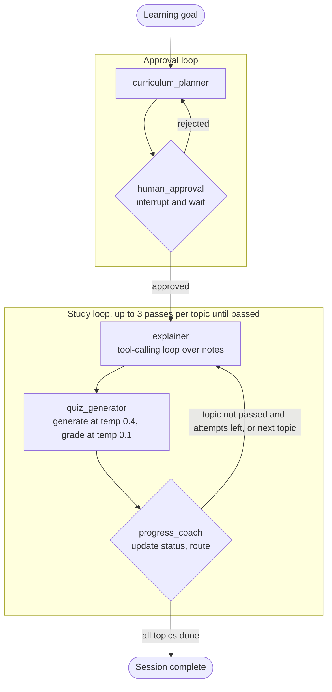

# Sherpa: Implementation Plan (v1 core build)

Sherpa is an AI study companion. The learner enters a learning goal. Sherpa drafts a curriculum and waits for the learner to approve it. Then, for each topic, it explains the material from the learner's own notes and the web, quizzes them, and decides whether to move on or re-teach.

This plan follows `architecture-flowchart.txt` exactly: four nodes, two loops, one human interrupt.

---

## 0. Decisions locked in

| Area | Decision |
|---|---|
| LLM | **Ollama `qwen2.5:7b`**, run on a **Kaggle GPU notebook**, exposed through an **ngrok tunnel** with basic auth |
| Embeddings | **`nomic-embed-text`**, served by the same Ollama instance; the base URL can be overridden to point at a local Ollama |
| Orchestration | **LangGraph** (`StateGraph`, conditional edges, `interrupt()`, `Command(resume=...)`) |
| Persistence | **LangGraph `SqliteSaver`** checkpointer (`data/checkpoints.sqlite`); sessions survive CLI exits and tunnel drops |
| Notes sources | **Local Markdown/text**, **PDFs**, **web search + URL fetch** |
| Retrieval | **ChromaDB** (persistent, cosine) + Ollama embeddings |
| Web search | **DuckDuckGo** through the `ddgs` package; pages fetched with `httpx` and cleaned with `trafilatura` |
| Quiz format | **MCQ only**: 4 options, exactly one correct |
| Grading | Correctness is **deterministic** (compare indices). The **temp 0.1** LLM call writes per-question feedback and finds weak objectives and misconceptions |
| Fail policy | Pass at **≥ 70%**. Below that, **retry the topic** with targeted re-explanation, **max 3 attempts total** (the learner repeats the explain → quiz pass until they pass or hit the cap). After the third failure the topic is marked `needs_review` and the session moves on |
| Interface | **CLI** (`typer` + `rich`) |
| Tooling | **Python 3.11, `pip` + `venv` + `requirements.txt`**, flat package layout, run as `python -m sherpa` |
| Out of scope for v1 | Automated tests, eval harness, tracing, report export. See `future-scope.txt` |

---

## 1. Architecture (source of truth)



### 1.1 Node responsibilities

| Node | Kind | LLM? | Reads from state | Writes to state |
|---|---|---|---|---|
| `curriculum_planner` | Structured generation | Yes (temp 0.2) | `goal`, `learner_level`, `approval_feedback`, `curriculum` (when revising), note titles | `curriculum`, `curriculum_rationale`, `revision_count` |
| `human_approval` | `interrupt()` | No | `curriculum` | `approval_status`, `approval_feedback` |
| `explainer` | Tool-calling loop (internal to the node) | Yes (temp 0.3) | current topic, `focus_areas`, `last_grade` | `explanation`, `sources` |
| `quiz_generator` | **Compiled subgraph**: generate → verify → collect (interrupt) → grade | Yes (0.4 to generate, 0.1 to verify and grade) | current topic, `explanation`, previous question stems | `quiz`, `answers`, `last_grade` |
| `progress_coach` | Deterministic status update and routing, plus a short LLM message | Message only (temp 0.5) | `curriculum`, `last_grade`, `current_topic_idx` | `curriculum` (status, attempts, scores), `current_topic_idx`, `focus_areas`, `coach_message` |

### 1.2 Why `quiz_generator` must be a subgraph

LangGraph **re-runs a node from the top** when it resumes after an `interrupt()`. Suppose generation, collecting answers and grading all lived in one node function. Then, after the learner answers, the resume would **regenerate the quiz at temp 0.4** and produce *different questions* from the ones the learner just answered.

The fix: compile `quiz_generator` as its own `StateGraph` with internal nodes `generate_quiz → verify_key → collect_answers → grade_quiz`, and add that compiled graph to the parent as the single node `quiz_generator`. Each inner node checkpoints when it finishes, so a resume re-runs only `collect_answers`. That node is cheap and has no side effects. The top-level graph still matches the architecture diagram exactly.

`human_approval` and `collect_answers` must **do nothing before `interrupt()`** that cannot safely run twice.

---

## 2. Project layout

```
sherpa/
├── architecture-flowchart.txt
├── plan.md
├── future-scope.txt
├── README.md
├── requirements.txt
├── .env.example
├── .gitignore                    # .env, .venv/, data/, __pycache__/
├── kaggle/
│   └── ollama_server.ipynb       # Kaggle notebook: Ollama + ngrok
├── notes/                        # learner's .md / .txt / .pdf files (user-provided)
├── data/                         # runtime, gitignored
│   ├── chroma/                   # vector store
│   ├── checkpoints.sqlite        # LangGraph checkpoints
│   ├── ingest_manifest.json      # file hash → chunk ids (idempotent ingest)
│   └── web_cache/                # cached fetched pages (sha1(url).txt)
└── sherpa/
    ├── __init__.py
    ├── __main__.py               # `python -m sherpa` → cli.app()
    ├── config.py                 # pydantic-settings Settings, loaded from .env
    ├── llm.py                    # ChatOllama / OllamaEmbeddings factories, auth headers, health check, retry
    ├── schemas.py                # pydantic models (LLM I/O contracts + state shapes)
    ├── state.py                  # SherpaState TypedDict + helpers (current_topic, etc.)
    ├── graph.py                  # build_graph(checkpointer) → compiled graph
    ├── prompts/
    │   ├── __init__.py           # load_prompt(name) helper
    │   ├── curriculum_planner.md
    │   ├── explainer_system.md
    │   ├── explainer_task.md
    │   ├── quiz_generate.md
    │   ├── quiz_verify.md
    │   ├── quiz_grade.md
    │   └── progress_coach.md
    ├── nodes/
    │   ├── __init__.py
    │   ├── curriculum_planner.py
    │   ├── human_approval.py
    │   ├── explainer.py
    │   ├── quiz_generator.py     # builds and compiles the quiz subgraph
    │   └── progress_coach.py
    ├── tools/
    │   ├── __init__.py
    │   ├── registry.py           # SourceRegistry: assigns [S1], [S2]... ids per explainer run
    │   ├── notes.py              # search_notes tool
    │   └── web.py                # web_search, fetch_url tools
    ├── ingest/
    │   ├── __init__.py
    │   ├── loaders.py            # md/txt/pdf → Documents with metadata
    │   ├── chunking.py           # markdown-aware + recursive splitting
    │   └── index.py              # Chroma collection mgmt, upsert, delete, query
    ├── structured.py             # invoke_structured(): schema call + validation retry
    └── cli.py                    # typer app: doctor, ingest, search, start, resume, sessions
```

The flat layout (package `sherpa/` at the repo root) means `python -m sherpa ...` works from the repo root without `pip install -e .`. That keeps the plain `requirements.txt` workflow.

---

## 3. Environment and dependencies

### 3.1 Local setup

```bash
python3.11 -m venv .venv
source .venv/bin/activate
pip install --upgrade pip
pip install -r requirements.txt
cp .env.example .env   # then fill in tunnel URL + basic auth
```

### 3.2 `requirements.txt` (lower bounds; pin exact versions with `pip freeze` once the first full run works)

```
# orchestration
langgraph>=1.0
langgraph-checkpoint-sqlite>=2.0
langchain-core>=1.0
langchain-ollama>=1.0
langchain-text-splitters>=1.0

# retrieval + ingestion
chromadb>=1.0
pypdf>=5.0

# web
ddgs>=9.0
httpx>=0.27
trafilatura>=2.0

# config / validation / resilience
pydantic>=2.7
pydantic-settings>=2.3
python-dotenv>=1.0
tenacity>=8.3

# CLI
typer>=0.12
rich>=13.7
```

> After installing, check that these imports work: `from langgraph.types import interrupt, Command`, `from langgraph.checkpoint.sqlite import SqliteSaver`, `from langchain_ollama import ChatOllama, OllamaEmbeddings`, `from ddgs import DDGS`. If a major version has moved an import, fix it before going further.

### 3.3 `.env.example`

```dotenv
# --- LLM endpoint (Kaggle + ngrok) ---
OLLAMA_BASE_URL=https://<your-static-domain>.ngrok-free.app
OLLAMA_BASIC_AUTH=sherpa:change-me-to-something-long   # must match the --basic-auth used in the Kaggle notebook
CHAT_MODEL=qwen2.5:7b
EMBED_MODEL=nomic-embed-text
EMBED_BASE_URL=                 # optional; empty = use OLLAMA_BASE_URL. Set to http://localhost:11434 to embed on local CPU
EMBED_BASIC_AUTH=               # optional; only if EMBED_BASE_URL needs different auth
NUM_CTX=8192
REQUEST_TIMEOUT_S=180
LLM_MAX_RETRIES=3

# --- temperatures (per node) ---
TEMP_PLANNER=0.2
TEMP_EXPLAINER=0.3
TEMP_QUIZ_GEN=0.4
TEMP_QUIZ_GRADE=0.1
TEMP_COACH=0.5

# --- curriculum ---
MIN_TOPICS=3
MAX_TOPICS=7
MAX_PLAN_REVISIONS=5            # soft cap: CLI warns, then forces approve-or-quit

# --- explainer ---
EXPLAINER_MAX_TOOL_ROUNDS=5
RETRIEVAL_TOP_K=4
RETRIEVAL_MIN_SIMILARITY=0.35   # cosine similarity; below this a hit is "weak"
FETCH_MAX_CHARS=6000
WEB_MAX_RESULTS=5

# --- quiz / progress ---
QUIZ_NUM_QUESTIONS=5
QUIZ_MIN_QUESTIONS=3
QUIZ_VERIFY_KEY=true
PASS_THRESHOLD=0.7
MAX_ATTEMPTS_PER_TOPIC=3

# --- paths ---
NOTES_DIR=./notes
DATA_DIR=./data
```

`config.py` uses one `Settings(BaseSettings)` class with these fields and their types, read once and cached through `get_settings()` with `@lru_cache`.

---

## 4. Phase 0: LLM server on Kaggle via ngrok

**Goal:** a stable, authenticated HTTPS endpoint serving `qwen2.5:7b` and `nomic-embed-text` from a Kaggle GPU.

### 4.1 One-time account setup

1. **ngrok**: create a free account, then copy the **authtoken**. Claim your free **static dev domain** (e.g. `something.ngrok-free.app`). With a static domain, `OLLAMA_BASE_URL` in `.env` never changes between Kaggle sessions.
2. **Kaggle**: verify your phone number, which is required for GPU and internet access. Then add three **Kaggle Secrets** (Add-ons → Secrets):
   - `NGROK_AUTHTOKEN`
   - `NGROK_DOMAIN` (e.g. `something.ngrok-free.app`)
   - `OLLAMA_BASIC_AUTH` (e.g. `sherpa:<long-random-password>`; ngrok needs the password to be 8–128 chars)
3. Notebook settings: **Accelerator = GPU T4 x2** (or P100), **Internet = On**, **Persistence = Files only** (optional; this keeps pulled models between sessions).

### 4.2 Notebook cells (`kaggle/ollama_server.ipynb`)

**Cell 1: install Ollama (plus the deps its installer needs)**
```bash
!apt-get update -qq && apt-get install -y -qq zstd pciutils lshw > /dev/null
!curl -fsSL https://ollama.com/install.sh | sh
```

**Cell 2: start the Ollama server in the background**
```python
import os, subprocess, time
os.environ.update({
    "OLLAMA_HOST": "0.0.0.0:11434",
    "OLLAMA_KEEP_ALIVE": "-1",          # keep model resident in VRAM
    "OLLAMA_CONTEXT_LENGTH": "8192",    # server default; client also sends num_ctx
})
ollama_log = open("/kaggle/working/ollama.log", "w")
ollama_proc = subprocess.Popen(["ollama", "serve"], stdout=ollama_log, stderr=subprocess.STDOUT)
time.sleep(5)
!curl -s localhost:11434/api/version
```

**Cell 3: pull the models**
```bash
!ollama pull qwen2.5:7b
!ollama pull nomic-embed-text
```

**Cell 4: warm up and check the GPU is used**
```bash
!ollama run qwen2.5:7b "Reply with the single word: ready"
!ollama ps        # PROCESSOR column must show 100% GPU
!nvidia-smi --query-gpu=name,memory.used,memory.total --format=csv
```

**Cell 5: start the ngrok tunnel with basic auth**
```python
from kaggle_secrets import UserSecretsClient
s = UserSecretsClient()
token, domain, auth = s.get_secret("NGROK_AUTHTOKEN"), s.get_secret("NGROK_DOMAIN"), s.get_secret("OLLAMA_BASIC_AUTH")

!curl -sSL https://bin.equinox.io/c/bNyj1mQVY4c/ngrok-v3-stable-linux-amd64.tgz | tar xz -C /usr/local/bin
subprocess.run(["ngrok", "config", "add-authtoken", token], check=True)
ngrok_log = open("/kaggle/working/ngrok.log", "w")
ngrok_proc = subprocess.Popen(
    ["ngrok", "http", "11434",
     "--url", domain,
     "--host-header=localhost:11434",   # Ollama rejects unknown Host headers otherwise
     "--basic-auth", auth,
     "--log=stdout"],
    stdout=ngrok_log, stderr=subprocess.STDOUT)
time.sleep(4)
print(f"Tunnel up: https://{domain}")
```

**Cell 6: keepalive and health loop (leave this running)**
```python
import urllib.request
while True:
    try:
        v = urllib.request.urlopen("http://localhost:11434/api/version", timeout=5).read().decode()
        print(time.strftime("%H:%M:%S"), "ollama ok", v, "| ngrok alive:", ngrok_proc.poll() is None)
    except Exception as e:
        print(time.strftime("%H:%M:%S"), "ollama DOWN:", e)
    time.sleep(120)
```

### 4.3 Operational notes

- A Kaggle GPU session lasts **12h at most**, and there is a **weekly GPU quota** (about 30h). Stop the notebook when you're not studying.
- Keep the notebook tab open, or the session can be reclaimed. Because the checkpointer saves after every node, a session that dies mid-study resumes exactly where it stopped.
- `qwen2.5:7b` (Q4_K_M, about 4.7 GB) plus an 8K context fits easily in a T4's 16 GB. If you want, you can raise `NUM_CTX` to 16384 later.
- The tunnel is public. **Basic auth is not optional.** Never paste the password into the notebook source; use Secrets only.

### 4.4 Done when

From your laptop, these succeed:

```bash
curl -u "$OLLAMA_BASIC_AUTH" "$OLLAMA_BASE_URL/api/tags"                  # lists both models
curl -u "$OLLAMA_BASIC_AUTH" "$OLLAMA_BASE_URL/api/chat" -d '{"model":"qwen2.5:7b","messages":[{"role":"user","content":"hi"}],"stream":false}'
curl -u "$OLLAMA_BASIC_AUTH" "$OLLAMA_BASE_URL/api/embed" -d '{"model":"nomic-embed-text","input":"hello"}'
curl "$OLLAMA_BASE_URL/api/tags"                                          # WITHOUT auth → 401
```

---

## 5. Phase 1: Skeleton, config, LLM client, schemas, state

### 5.1 `sherpa/llm.py`

Responsibilities:

- `auth_headers(basic_auth: str | None) -> dict`: builds `{"Authorization": "Basic <b64>", "ngrok-skip-browser-warning": "1"}`.
- `get_chat(role: Literal["planner","explainer","quiz_gen","quiz_grade","coach"]) -> ChatOllama`: picks the temperature for `role` from Settings and caches one instance per role.
  ```python
  ChatOllama(
      model=s.chat_model, base_url=s.ollama_base_url,
      temperature=temp, num_ctx=s.num_ctx,
      client_kwargs={"headers": auth_headers(s.ollama_basic_auth), "timeout": s.request_timeout_s},
  )
  ```
- `get_embeddings() -> OllamaEmbeddings`: uses `EMBED_BASE_URL` if set, otherwise `OLLAMA_BASE_URL`.
- `with_retry(fn)`: a `tenacity` decorator that retries on `httpx.ConnectError`, `httpx.ReadTimeout`, `ollama.ResponseError` with status 5xx, and ngrok 502/504. It uses exponential backoff (2s, 4s, 8s) for `LLM_MAX_RETRIES` attempts. After the last attempt it raises `LLMUnavailableError`, with a clear message: *"LLM endpoint unreachable. Is the Kaggle notebook running? Then run `python -m sherpa resume <id>`."*
- `healthcheck() -> HealthReport`: GET `/api/version`, then GET `/api/tags` to confirm both models are present, then a 1-token chat call (latency) and a 1-string embed call (dimension). `doctor` uses it.

### 5.2 `sherpa/structured.py`: reliable structured output from a 7B model

```python
def invoke_structured(llm, schema: type[BaseModel], messages, *, max_repairs=2) -> BaseModel:
    """Ask for JSON matching `schema` (Ollama `format` = JSON schema), validate with pydantic,
    and on ValidationError append the error and ask the model to fix it."""
```

- Use `llm.with_structured_output(schema, method="json_schema", include_raw=True)`. Ollama constrains decoding to the schema, which removes most format errors.
- Semantic validation (pydantic `model_validator`s, see §5.3) can still fail. On failure, append an `AIMessage(raw)` plus a `HumanMessage("Your output failed validation: <errors>. Return corrected JSON only.")` and retry, up to `max_repairs` times.
- If it still fails, raise `StructuredOutputError`, and the node decides what to do (see each node's error handling).

### 5.3 `sherpa/schemas.py`

**LLM output contracts** (what the model must return):

```python
class TopicDraft(BaseModel):
    id: str                          # "t1", "t2", ...
    title: str                       # ≤ 80 chars
    objectives: list[str]            # 2–4, each starts with an action verb
    prerequisites: list[str] = []    # ids of EARLIER topics only
    est_minutes: int                 # 10–45

class CurriculumDraft(BaseModel):
    rationale: str                   # 1–3 sentences: why this order/scope
    topics: list[TopicDraft]
    # validators: MIN_TOPICS ≤ len ≤ MAX_TOPICS; ids unique and sequential;
    # every prerequisite refers to a topic with a smaller index (topological order);
    # objectives 2–4 and non-empty

class MCQDraft(BaseModel):
    objective: str                   # must match one of the topic objectives (fuzzy match ok)
    question: str
    correct_answer: str
    distractors: list[str]           # exactly 3, all distinct from each other and from correct_answer
    explanation: str                 # why the correct answer is correct (1–2 sentences)

class QuizDraft(BaseModel):
    questions: list[MCQDraft]

class KeyCheck(BaseModel):           # verify_key output
    answers: list[Literal["A","B","C","D"]]

class QuestionFeedback(BaseModel):
    question_id: str
    feedback: str                    # 1–3 sentences, addressed to learner
    misconception: str | None        # what the chosen distractor suggests they believe

class GradeFeedback(BaseModel):      # quiz_grade (temp 0.1) output
    per_question: list[QuestionFeedback]   # only for incorrect answers
    weak_objectives: list[str]
    summary: str
```

**State-side shapes.** These are stored in state as plain dicts produced by `.model_dump()`. Keeping state JSON-serializable avoids checkpointer serialization surprises with custom classes.

```python
class Topic(TopicDraft):
    status: Literal["pending","in_progress","passed","needs_review"] = "pending"
    attempts: int = 0
    scores: list[float] = []

class MCQ(BaseModel):
    id: str                          # f"{topic_id}-a{attempt}-q{n}"
    objective: str
    question: str
    options: list[str]               # 4, shuffled in code
    correct_index: int               # 0–3, computed in code after shuffle
    explanation: str

class Source(BaseModel):
    sid: str                         # "S1"
    kind: Literal["note","web"]
    title: str
    location: str                    # file path + page/heading, or URL

class GradeReport(BaseModel):
    topic_id: str
    attempt: int
    score: float                     # correct / total, computed in code
    correct: list[str]               # question ids
    incorrect: list[str]
    feedback: list[QuestionFeedback]
    weak_objectives: list[str]
    misconceptions: list[str]
    summary: str
```

### 5.4 `sherpa/state.py`

```python
class SherpaState(TypedDict, total=False):
    # session
    session_id: str
    goal: str
    learner_level: str                       # "beginner" | "intermediate" | "advanced"
    note_titles: list[str]                   # snapshot of indexed docs for the planner

    # approval loop
    curriculum: list[dict]                   # list[Topic]
    curriculum_rationale: str
    approval_status: Literal["pending", "approved", "rejected"]
    approval_feedback: str | None
    revision_count: int

    # study loop
    current_topic_idx: int
    focus_areas: list[str]                   # set by coach on retry; [] on a fresh topic
    explanation: str
    sources: list[dict]                      # list[Source]
    quiz: list[dict]                         # list[MCQ]
    answers: list[int]                       # learner's chosen indices, aligned with quiz
    last_grade: dict | None                  # GradeReport
    asked_questions: dict[str, list[str]]    # topic_id → question stems already asked (avoid repeats)
    coach_message: str

    # append-only audit log (reducer)
    events: Annotated[list[dict], operator.add]   # {"ts","node","type","data"}
```

Helpers: `current_topic(state) -> Topic`, `next_open_topic_idx(curriculum) -> int | None`, `log_event(node, type, **data) -> dict`.

### 5.5 Done when

- `python -m sherpa doctor` prints a green table: endpoint reachable, auth OK, both models present, chat latency, embedding dimension (768 for nomic), and the Chroma path is writable.
- A scratch call `invoke_structured(get_chat("planner"), CurriculumDraft, [...])` returns a valid object for "Learn linear regression".

---

## 6. Phase 2: Ingestion and retrieval

### 6.1 Loaders (`ingest/loaders.py`)

| Type | Loader | Metadata |
|---|---|---|
| `.md`, `.markdown` | read text (UTF-8, `errors="replace"`) | `source`, `title` (first H1 or filename), `kind="md"` |
| `.txt` | read text | `source`, `title` (filename), `kind="txt"` |
| `.pdf` | `pypdf.PdfReader`, one Document per page | `source`, `title` (PDF metadata title or filename), `page` (1-based), `kind="pdf"` |

- Skip pages with no text and warn: *"page N has no extractable text, possibly scanned"*. OCR is out of scope.
- Normalize whitespace and remove repeated header/footer lines (a line appearing on ≥ 50% of pages).
- If PDF extraction quality is poor, swap `pypdf` → `pymupdf` (better layout handling; AGPL license).

### 6.2 Chunking (`ingest/chunking.py`)

- **Markdown:** `MarkdownHeaderTextSplitter` on `#`, `##`, `###`, so the heading path goes into metadata (`section="Intro > Gradient descent"`). Then `RecursiveCharacterTextSplitter`.
- **Text/PDF:** `RecursiveCharacterTextSplitter` directly.
- Parameters: `chunk_size=1200` chars, `chunk_overlap=150`. That's roughly 300 tokens, so 4 hits stay at about 1.2K tokens of context.
- Chunk id = `sha1(f"{source}|{page}|{chunk_index}|{text}")[:16]`.

### 6.3 Index (`ingest/index.py`)

- `chromadb.PersistentClient(path=DATA_DIR/"chroma")`, collection `notes`, `metadata={"hnsw:space": "cosine", "embed_model": EMBED_MODEL}`.
- **Guard:** if the collection's `embed_model` ≠ the current `EMBED_MODEL`, refuse to query and tell the user to run `ingest --reset`.
- **nomic-embed-text task prefixes:** documents are embedded as `"search_document: " + text` and queries as `"search_query: " + text`. Without the prefixes, retrieval quality drops noticeably.
- Batch embedding: 32 chunks per `/api/embed` call, with a `rich` progress bar.
- **Idempotency** via `data/ingest_manifest.json`, which maps `{source_path: {"sha256": ..., "chunk_ids": [...]}}`:
  - unchanged file → skip
  - changed file → delete its old chunk ids, then add the new ones
  - file removed from disk → delete its chunks (only with `--prune`)
- `query(text, k) -> list[Hit]`, where `Hit = {id, text, source, title, page?, section?, similarity}` and `similarity = 1 - cosine_distance`.
- `list_titles() -> list[str]`: distinct document titles, which feed the planner.

### 6.4 CLI

```
python -m sherpa ingest [PATHS...] [--reset] [--prune]   # default PATHS = NOTES_DIR
python -m sherpa search "query" [-k 4]                    # debug: shows hits + similarity
```

### 6.5 Done when

- Ingesting a folder with 2 Markdown files and 1 PDF reports the file, chunk and skip counts.
- Re-running ingest immediately reports "0 changed".
- `search "<phrase from a PDF page>"` returns that page in the top 3 with similarity ≥ 0.5.

---

## 7. Phase 3: Explainer tools

All tools are created **per explainer run** by `make_tools(registry: SourceRegistry, settings)`. They're closures, so each run gets fresh source numbering. Every tool **returns a string** (never raises): errors come back to the model as text like `"ERROR: web search unavailable (rate limited). Continue with what you have."`

### 7.1 `SourceRegistry` (`tools/registry.py`)

- `add(kind, title, location) -> "S<n>"`: deduplicates on `location`.
- `all() -> list[Source]`
- `cited(text) -> list[Source]`: sources whose `[S<n>]` appears in the final text.
- `strip_invalid(text) -> str`: removes `[S<n>]` markers that don't exist in the registry, so the model can't invent citations.

### 7.2 `search_notes(query: str, k: int = 4) -> str`

- Calls `index.query`, keeps hits with `similarity ≥ RETRIEVAL_MIN_SIMILARITY`, and registers each hit's source.
- Output format, which is compact and citable:
  ```
  [S1] notes/ml-basics.md › Gradient descent (sim 0.71)
  <chunk text>
  ---
  [S2] notes/lecture3.pdf p.12 (sim 0.64)
  <chunk text>
  ```
- If no hit passes the threshold, it returns `"NO_RELEVANT_NOTES for '<query>'. Consider web_search."` This explicit signal tells the model when to go to the web.

### 7.3 `web_search(query: str) -> str`

- `DDGS().text(query, max_results=WEB_MAX_RESULTS)` returns title, URL and snippet for each result. Each result is registered as a `web` source.
- Results contain only snippets. The model must call `fetch_url` to read a page.
- Catch rate-limit and network exceptions and return an error string.

### 7.4 `fetch_url(url: str) -> str`

- `httpx.get(url, timeout=15, follow_redirects=True, headers={"User-Agent": "Sherpa/0.1 (study assistant)"})`.
- Accept only `text/html` and `text/plain`. Everything else → error string.
- `trafilatura.extract(html, include_comments=False, include_tables=True)`.
- Truncate to `FETCH_MAX_CHARS`, preferring paragraph boundaries. Cache the result to `data/web_cache/<sha1(url)>.txt`.
- Register the page as a source and return `"[S<n>] <title> (<url>)\n<text>"`.

### 7.5 Tool definitions

Use `@tool` from `langchain_core.tools` with **clear docstrings**. The 7B model chooses tools by their descriptions:

- `search_notes`: "Search the learner's own study notes (Markdown, text, PDFs). ALWAYS try this first."
- `web_search`: "Search the web. Use ONLY when search_notes returned NO_RELEVANT_NOTES or the notes are insufficient for an objective."
- `fetch_url`: "Read the main text of a web page returned by web_search."

### 7.6 Done when

Calling each tool directly from a Python shell returns well-formatted strings. `fetch_url` on a Wikipedia article returns clean text, and the source registry numbers the sources correctly.

---

## 8. Phase 4: Graph skeleton, `curriculum_planner`, `human_approval`, CLI approval loop

Build the full graph wiring **now**, with `explainer`, `quiz_generator` and `progress_coach` as **stubs** that return canned data. That lets the whole flow, including persistence and resume, be exercised end to end before the hard nodes exist.

### 8.1 `graph.py`

```python
def build_graph(checkpointer):
    g = StateGraph(SherpaState)
    g.add_node("curriculum_planner", curriculum_planner)
    g.add_node("human_approval", human_approval)
    g.add_node("explainer", explainer)
    g.add_node("quiz_generator", build_quiz_subgraph())   # compiled subgraph (§10)
    g.add_node("progress_coach", progress_coach)

    g.add_edge(START, "curriculum_planner")
    g.add_edge("curriculum_planner", "human_approval")
    g.add_conditional_edges("human_approval", route_after_approval,
                            {"rejected": "curriculum_planner", "approved": "explainer"})
    g.add_edge("explainer", "quiz_generator")
    g.add_edge("quiz_generator", "progress_coach")
    g.add_conditional_edges("progress_coach", route_after_coach,
                            {"topics_remain": "explainer", "all_done": END})
    return g.compile(checkpointer=checkpointer)

def route_after_approval(state) -> str:
    return "approved" if state["approval_status"] == "approved" else "rejected"

def route_after_coach(state) -> str:
    return "topics_remain" if next_open_topic_idx(state["curriculum"]) is not None else "all_done"
```

Checkpointer setup in `cli.py`:

```python
conn = sqlite3.connect(DATA_DIR / "checkpoints.sqlite", check_same_thread=False)
checkpointer = SqliteSaver(conn)
graph = build_graph(checkpointer)
config = {"configurable": {"thread_id": session_id}, "recursion_limit": 200}
```

`recursion_limit`: each topic pass is about 3 top-level steps. With 7 topics × 3 attempts (about 63 steps) plus the approval loop, the default of 25 is far too low, so set 200.

### 8.2 `curriculum_planner` node

**Input:** `goal`, `learner_level`, `note_titles`, and when revising, the previous `curriculum` plus `approval_feedback`.

**Process:**
1. Build messages from `prompts/curriculum_planner.md` (§13.1).
2. `invoke_structured(get_chat("planner"), CurriculumDraft, messages)`.
3. Convert each `TopicDraft` → `Topic` (status `pending`, attempts 0).
4. If this is a revision, `revision_count += 1`.

**Output:** `curriculum`, `curriculum_rationale`, `approval_status="pending"`, `revision_count`, an event.

**Error handling:** a `StructuredOutputError` after repairs is re-raised. The CLI shows it, the checkpoint stays before the node, and `resume` retries it.

### 8.3 `human_approval` node

```python
def human_approval(state):
    decision = interrupt({
        "type": "curriculum_approval",
        "curriculum": state["curriculum"],
        "rationale": state["curriculum_rationale"],
        "revision_count": state.get("revision_count", 0),
        "max_revisions": settings.max_plan_revisions,
    })
    # decision = {"approved": bool, "feedback": str | None}
    if decision["approved"]:
        return {"approval_status": "approved", "approval_feedback": None,
                "current_topic_idx": 0, "focus_areas": [], "asked_questions": {},
                "events": [log_event("human_approval", "approved")]}
    return {"approval_status": "rejected", "approval_feedback": decision["feedback"],
            "events": [log_event("human_approval", "rejected", feedback=decision["feedback"])]}
```

Nothing happens before `interrupt()`, so re-running the node on resume is safe.

### 8.4 CLI driver loop (the core of `cli.py`)

```python
def drive(graph, config, first_input):
    payload = first_input
    while True:
        interrupted = None
        for chunk in graph.stream(payload, config, stream_mode="updates"):
            if "__interrupt__" in chunk:
                interrupted = chunk["__interrupt__"][0].value
            else:
                render_update(chunk)        # print explanation, grade feedback, coach msg...
        if interrupted is None:
            render_session_summary(graph.get_state(config).values)
            return
        payload = Command(resume=handle_interrupt(interrupted))   # prompts the user
```

`handle_interrupt` dispatches on `value["type"]`:
- `curriculum_approval` → renders a `rich.Table` (id, title, objectives, prereqs, minutes) and the rationale, then prompts `[a]pprove / [r]eject with feedback / [q]uit`.
  - Reject requires non-empty feedback.
  - `q` → print `Session saved. Resume with: python -m sherpa resume <id>`, then exit 0.
  - If `revision_count ≥ max_revisions`, warn: "Many revisions so far, consider approving and adjusting later."
- `quiz` → see §10.4.

### 8.5 CLI commands

```
python -m sherpa start "Learn linear regression" [--level beginner]   # new session_id = short uuid
python -m sherpa resume <session_id>
python -m sherpa sessions                                               # list thread_ids, goal, progress, last update
```

**`resume` logic:**
```python
snap = graph.get_state(config)
if snap.interrupts:            # paused at human_approval or collect_answers
    drive(graph, config, Command(resume=handle_interrupt(snap.interrupts[0].value)))
elif snap.next:                # crashed / tunnel dropped mid-run
    drive(graph, config, None) # continue from last checkpoint
else:
    print("Session already complete."); render_session_summary(snap.values)
```

**`sessions`:** to read distinct thread ids, either query the checkpointer's sqlite (`SELECT DISTINCT thread_id FROM checkpoints`) or keep a small `data/sessions.json` index (`session_id, goal, created_at`) that `start` writes. **Pick the `sessions.json` index**, since it doesn't depend on checkpointer internals.

### 8.6 Done when

- `start "Learn linear regression"` shows a curriculum. Rejecting with "add a topic on regularization" produces a revised plan that includes it.
- Pressing `q` and then running `resume <id>` shows the same pending curriculum without calling the LLM again.
- Approving runs through the stubs to "Session complete".

---

## 9. Phase 5: `explainer` node (tool-calling loop over notes)

### 9.1 Algorithm

```python
def explainer(state):
    topic = current_topic(state)
    is_retry = topic["attempts"] > 0
    registry = SourceRegistry()
    tools = make_tools(registry, settings)
    by_name = {t.name: t for t in tools}
    llm_tools = get_chat("explainer").bind_tools(tools)

    # 1. Seed retrieval: always run one notes search ourselves so the model
    #    starts grounded even if it under-uses tools.
    seed_query = f"{topic['title']}: " + "; ".join(topic["objectives"])
    seed = by_name["search_notes"].invoke({"query": seed_query, "k": settings.retrieval_top_k})

    messages = [
        SystemMessage(load_prompt("explainer_system")),
        HumanMessage(load_prompt("explainer_task").format(
            goal=state["goal"], level=state["learner_level"],
            title=topic["title"], objectives=bullets(topic["objectives"]),
            retry_block=retry_block(state) if is_retry else "",
            seed_results=seed)),
    ]

    # 2. Tool loop
    for _ in range(settings.explainer_max_tool_rounds):
        ai = with_retry(llm_tools.invoke)(messages)
        ai = coerce_text_tool_calls(ai)          # see 9.3
        messages.append(ai)
        if not ai.tool_calls:
            break
        for tc in ai.tool_calls:
            tool = by_name.get(tc["name"])
            out = tool.invoke(tc["args"]) if tool else f"ERROR: unknown tool {tc['name']}"
            messages.append(ToolMessage(content=out, tool_call_id=tc["id"]))
    else:
        # 3. Budget exhausted → force a final answer without tools
        messages.append(HumanMessage("Tool budget reached. Write the final explanation now using only the material above."))
        ai = with_retry(get_chat("explainer").invoke)(messages)

    text = ai.content.strip()
    if len(text) < 200:                          # empty/degenerate → one retry
        messages.append(HumanMessage("Write the full explanation now, following the required structure."))
        text = with_retry(get_chat("explainer").invoke)(messages).content.strip()

    text = registry.strip_invalid(text)
    return {
        "explanation": text,
        "sources": [s.model_dump() for s in registry.cited(text)],
        "curriculum": mark_in_progress(state["curriculum"], state["current_topic_idx"]),
        "events": [log_event("explainer", "explained", topic=topic["id"], attempt=topic["attempts"] + 1,
                             tool_calls=count_tool_calls(messages), sources=len(registry.all()))],
    }
```

> Status ownership: `explainer` only flips `pending → in_progress` so that the "currently studying" display is accurate. Every outcome status (`passed`, `needs_review`) and every attempt and score update happens in `progress_coach`.

### 9.2 Context budget (`NUM_CTX=8192`)

| Part | Approx tokens |
|---|---|
| System + task prompt | ~700 |
| Seed retrieval (4 × ~300) | ~1,200 |
| Up to 5 tool rounds (search ≈ 1,200, fetch ≈ 1,500 each) | ≤ ~4,500 worst case |
| Output (explanation, 400–700 words) | ~1,000 |

If the history gets large, add a guard: before each LLM call, estimate tokens as `len(text)/3.5`. If the estimate exceeds 6,500, replace the content of the oldest `ToolMessage`s with `"[truncated — already summarized]"`, keeping their ids so the message pairing stays valid.

### 9.3 Robustness for a 7B model

- **Text-encoded tool calls:** Qwen sometimes writes the tool call as JSON in `content` (e.g. `{"name": "search_notes", "arguments": {...}}`, or inside `<tool_call>` tags) instead of in structured `tool_calls`. `coerce_text_tool_calls` detects this with a regex plus `json.loads` and converts it into a proper `tool_calls` entry with a generated id.
- **Repeated identical calls:** keep a set of `(name, frozen args)` already run. If the model repeats one, answer with `"You already ran this exact call; use the results above."` instead of executing it again.
- **Unknown tool names / bad args:** return an error string. Never raise.

### 9.4 CLI rendering

When the `explainer` update arrives, show the topic header (`Topic 2/5 · Gradient descent · attempt 1`), the explanation as `rich.Markdown`, and a "Sources" list (`[S1] notes/ml.md › Gradient descent`, `[S2] https://...`). Then prompt `Press Enter when you're ready for the quiz`.

### 9.5 Done when

- A topic that your notes cover produces an explanation citing only `note` sources.
- A topic absent from your notes triggers `web_search` → `fetch_url` and cites web sources.
- There are no `[S#]` markers without a matching source.
- A retry explanation (simulated by setting `attempts=1` and a fake `last_grade`) visibly focuses on the weak objectives.

---

## 10. Phase 6: `quiz_generator` subgraph

### 10.1 Subgraph shape

```python
def build_quiz_subgraph():
    q = StateGraph(SherpaState)
    q.add_node("generate_quiz", generate_quiz)      # temp 0.4
    q.add_node("verify_key", verify_key)            # temp 0.1 (skipped if QUIZ_VERIFY_KEY=false)
    q.add_node("collect_answers", collect_answers)  # interrupt()
    q.add_node("grade_quiz", grade_quiz)            # deterministic score + temp 0.1 feedback
    q.add_edge(START, "generate_quiz")
    q.add_edge("generate_quiz", "verify_key")
    q.add_edge("verify_key", "collect_answers")
    q.add_edge("collect_answers", "grade_quiz")
    q.add_edge("grade_quiz", END)
    return q.compile()   # parent's checkpointer is inherited automatically
```

### 10.2 `generate_quiz` (temp 0.4)

1. Prompt (§13.4) with the topic, its objectives, **the explanation text** (questions must be answerable from it), `QUIZ_NUM_QUESTIONS`, and the previous question stems for this topic from `asked_questions[topic_id]` (avoid repeats on retry). On a retry, also include `weak_objectives`, and ask that **at least half** the questions target them.
2. `invoke_structured(get_chat("quiz_gen"), QuizDraft, ...)`.
3. **Validate each question in code** and drop any that fail:
   - exactly 3 distractors
   - all 4 options distinct (case-insensitive and whitespace-normalized)
   - no "all of the above" / "none of the above" / "both A and B"
   - question ends with `?` or is a fill-in with `___`
   - objective matches a topic objective (fuzzy: `difflib.SequenceMatcher` ratio ≥ 0.6; otherwise assign the closest objective)
4. **Shuffle options in code** with `random.Random(f"{session_id}-{topic_id}-{attempt}")`. This prevents the LLM's positional bias (the correct answer is almost always first) and makes the order reproducible on resume. Record `correct_index` after the shuffle.
5. If fewer than `QUIZ_MIN_QUESTIONS` remain valid, regenerate once with the dropped reasons included in the prompt. If it's still too few, proceed with whatever is valid (at least 1). If none are valid, raise.
6. Output: `quiz` (list[MCQ] dicts), and append the stems to `asked_questions[topic_id]`.

### 10.3 `verify_key` (temp 0.1, toggled by `QUIZ_VERIFY_KEY`)

A 7B model sometimes writes a wrong answer key. Self-check:

1. Send the explanation plus every question with its shuffled options labeled A–D, **without the key**, and ask for the best answer to each → `KeyCheck`.
2. For each question where the model's blind answer ≠ `correct_index`, **drop it** and log a `key_disagreement` event with both answers.
3. If dropping takes the quiz below `QUIZ_MIN_QUESTIONS`, keep the disagreeing questions but flag them `uncertain=True` in the event log. Don't block the learner over this.

### 10.4 `collect_answers` (interrupt)

```python
def collect_answers(state):
    answers = interrupt({
        "type": "quiz",
        "topic": current_topic(state)["title"],
        "attempt": current_topic(state)["attempts"] + 1,
        "questions": [{"id": q["id"], "question": q["question"], "options": q["options"]} for q in state["quiz"]],
    })
    # answers: list[int], one 0–3 per question
    return {"answers": answers}
```

The **interrupt payload never includes `correct_index`**, so the CLI never has the answers in hand. The CLI renders each question with `A) … D)`, accepts `a/b/c/d` (case-insensitive) and re-prompts on invalid input. Before submitting, it shows a review screen: *"Submit? [y]es / [c]hange answer N"*.

### 10.5 `grade_quiz` (deterministic + temp 0.1)

1. **Score in code:** `score = sum(a == q.correct_index) / len(quiz)`, plus the lists `correct` and `incorrect`.
2. If anything is incorrect, call the LLM at **temp 0.1** with the prompt in §13.6. For each incorrect question it receives the question, the correct option, the learner's chosen option and the stored `explanation`. Output: `GradeFeedback` (per-question feedback plus misconception, weak objectives, summary).
3. If everything is correct, skip the LLM: `weak_objectives=[]`, `summary="Perfect score."`
4. **Fallback** if the feedback call fails after repairs: build the feedback from each question's stored `explanation`, and set `weak_objectives` to the objectives of the incorrect questions. Grading never blocks the session.
5. **Always compute `weak_objectives` from code as well**: the union of the incorrect questions' objectives with the LLM's list. The LLM can add objectives but can't remove ones the code found.
6. Output: `last_grade` (a GradeReport dict) and an event.

### 10.6 Done when

- A 5-question quiz renders and accepts answers.
- Resuming after quitting mid-quiz (Ctrl-C at the prompt, then `resume`) shows **the same questions in the same order**.
- Correct answers aren't consistently in the same position.
- Deliberately wrong answers produce specific feedback and the right `weak_objectives`.

---

## 11. Phase 7: `progress_coach` node and study-loop routing

### 11.1 Status transition rules (pure Python, no LLM)

Let `t = curriculum[current_topic_idx]`, `g = last_grade`:

```
t.attempts += 1
t.scores.append(g.score)

if g.score >= PASS_THRESHOLD:
    t.status = "passed"
    focus_areas = []
    advance = True
elif t.attempts < MAX_ATTEMPTS_PER_TOPIC:
    t.status = "in_progress"            # retry same topic
    focus_areas = g.weak_objectives + g.misconceptions
    advance = False
else:
    t.status = "needs_review"
    focus_areas = []
    advance = True

if advance:
    nxt = next_open_topic_idx(curriculum)   # first topic with status in {"pending","in_progress"}
    current_topic_idx = nxt if nxt is not None else current_topic_idx
```

| Score | Attempts after update | New status | Route |
|---|---|---|---|
| ≥ 0.70 | any | `passed` | next pending topic, or END |
| < 0.70 | 1 or 2 (< `MAX_ATTEMPTS_PER_TOPIC`) | `in_progress` | `explainer` (same topic, retry focus) |
| < 0.70 | 3 (= `MAX_ATTEMPTS_PER_TOPIC`) | `needs_review` | next pending topic, or END |

`route_after_coach` (§8.1) only checks whether any topic is still `pending` or `in_progress`. With these rules, it routes to `explainer` for both "retry this topic" and "start the next topic", which matches the single "topics remain" edge in the architecture.

### 11.2 Coach message (temp 0.5)

A 2–3 sentence encouraging message that mentions the score, what went well and what comes next (retry focus, or the next topic's title). Prompt in §13.7. **Fallback template** if the LLM fails: `"You scored {pct}% on {title}. {next_step}"`. The coach message must never block routing.

### 11.3 State resets when advancing to a new topic

Clear `explanation`, `sources`, `quiz`, `answers` and `focus_areas`. Keep `last_grade` only until the explainer of the *same* topic has used it. On advancing, set `last_grade=None`.

### 11.4 CLI rendering after the coach

- Score bar (`3/5 · 60%`), each incorrect question's feedback and misconception, the coach message, and a compact progress line: `✓ t1  ✓ t2  ↻ t3  · t4  · t5`.
- `Press Enter to continue, or q to save and quit`. Quitting here is safe: the next step is `explainer`, and `resume` continues there.

### 11.5 End-of-session summary (CLI only, printed)

When the graph reaches END, print a table: topic, status, attempts, best score. Below it, list the `needs_review` topics with their weak objectives. (Exporting this as a Markdown report is in `future-scope.txt`.)

### 11.6 Done when

Run a full session with 3 topics:
- pass t1 on the first try
- fail t2 three times → `needs_review`
- fail t3 once, then pass on the second attempt

Routing, statuses and the summary must match the table in §11.1.

---

## 12. Phase 8: Hardening and polish

- **Tunnel drop mid-node:** `with_retry` exhausts its attempts → `LLMUnavailableError` → the CLI catches it at the top level and prints the recovery steps:
  1. restart the Kaggle notebook
  2. confirm `doctor` is green
  3. run `resume <id>`

  The checkpoint holds every node that finished.
- **Ctrl-C anywhere:** catch `KeyboardInterrupt` in the CLI and print the resume hint. Never print a traceback for it.
- **`doctor` before `start`/`resume`:** run a fast health check (version + tags only, under 3s) and fail early with clear guidance.
- **Logging:** use the `logging` module, with a `--verbose` flag that sets DEBUG and logs tool calls, token estimates and retries to `data/sherpa.log`. The `events` list in state remains the audit trail of the learning session.
- **Prompt files:** store prompts as `.md` with `{placeholders}`, so you can iterate on them without touching code. Escape literal braces as `{{ }}`.
- **README.md:** quickstart (Kaggle setup → `.env` → `doctor` → `ingest` → `start`), the command reference, and troubleshooting:
  - 401 → auth mismatch
  - 502/504 → notebook asleep
  - "model not found" → pull it in Cell 3
  - "embedding model mismatch" → `ingest --reset`

---

## 13. Prompt drafts

These are starting points. The bracketed parts are filled in by code.

### 13.1 `curriculum_planner.md`

```
You are an expert curriculum designer creating a focused self-study plan.

LEARNING GOAL: {goal}
LEARNER LEVEL: {level}
AVAILABLE NOTES (document titles the learner already has): 
{note_titles}

Design between {min_topics} and {max_topics} topics that together achieve the goal.
Rules:
- Order topics so every prerequisite comes BEFORE the topic that needs it.
- ids are "t1", "t2", ... in order. prerequisites list only earlier ids.
- Each topic has 2–4 learning objectives. Each objective starts with a measurable verb
  (explain, compute, compare, derive, identify, apply, implement) and is testable with a multiple-choice question.
- Pitch depth to the learner level. Do not include topics the goal does not need.
- Prefer topics the available notes cover when they fit the goal.
- est_minutes between 10 and 45.
- rationale: 1–3 sentences on scope and ordering.
{revision_block}
```
`revision_block` (only when revising):
```
REVISION REQUEST. The learner rejected the previous plan.
PREVIOUS PLAN:
{previous_curriculum_as_compact_list}
LEARNER FEEDBACK: "{feedback}"
Revise the plan to fully address the feedback. Keep the parts the feedback did not criticize.
```

### 13.2 `explainer_system.md`

```
You are Sherpa, a patient, precise tutor. You teach ONE topic at a time.

You have tools:
- search_notes: the learner's own notes. Always prefer these.
- web_search: only when notes return NO_RELEVANT_NOTES or miss an objective.
- fetch_url: read a page found by web_search before relying on it.

Rules:
- Ground every factual claim in tool results. Cite with the [S#] id shown in the results, e.g. "... [S2]".
- Never invent citations or sources. If something is not in the material, you may explain it from general
  knowledge but do not cite it.
- Call tools only when you need more material. When you have enough, write the final explanation (no tool call).
```

### 13.3 `explainer_task.md`

```
GOAL: {goal}   LEVEL: {level}
TOPIC: {title}
OBJECTIVES:
{objectives}
{retry_block}
Initial results from the learner's notes:
{seed_results}

Write the explanation in Markdown, 400–700 words, with this structure:
## Overview: 2–3 sentences on what and why.
## Key ideas: one short subsection per objective.
## Worked example: one concrete example, step by step.
## Common pitfalls: 2–4 bullets.
## Recap: exactly 3 bullets.
```
`retry_block`:
```
THIS IS A RETRY. The learner scored {pct}% last time.
Weak objectives: {weak_objectives}
Misconceptions observed: {misconceptions}
Re-teach with a DIFFERENT angle and example than before. Address each misconception directly.
```

### 13.4 `quiz_generate.md` (temp 0.4)

```
Write {n} multiple-choice questions for the topic "{title}".

Use ONLY facts stated in the EXPLANATION below. Every question must be answerable from it.
OBJECTIVES (each question tests exactly one; cover every objective at least once):
{objectives}
{retry_focus}
Do NOT repeat or paraphrase these earlier questions:
{previous_stems}

For each question give:
- objective: the objective text it tests
- question: clear, unambiguous, single best answer
- correct_answer: the correct option text
- distractors: exactly 3 plausible but clearly wrong options, ideally reflecting common misconceptions
- explanation: 1–2 sentences on why the correct answer is right
Forbidden: "all of the above", "none of the above", "both A and B", trick wording, negatives like "which is NOT" unless essential.
Options should be similar in length and style.

EXPLANATION:
{explanation}
```

### 13.5 `quiz_verify.md` (temp 0.1)

```
Answer each multiple-choice question using ONLY the reference text. Return one letter (A–D) per question, in order.

REFERENCE:
{explanation}

QUESTIONS:
{numbered_questions_with_lettered_options}
```

### 13.6 `quiz_grade.md` (temp 0.1)

```
You are grading a learner's quiz on "{title}". The answers have ALREADY been scored; do not re-score.
For each INCORRECT answer below, write:
- feedback: 1–3 sentences, addressed to the learner ("you"), explaining why the correct option is right
  and why their choice is not.
- misconception: one short phrase naming the belief their choice suggests, or null if unclear.
Then list weak_objectives (objectives the learner has not mastered) and a one-sentence summary.

INCORRECT ANSWERS:
{for each: id, objective, question, correct option, learner's option, stored explanation}

CORRECTLY ANSWERED OBJECTIVES: {correct_objectives}
```

### 13.7 `progress_coach.md` (temp 0.5)

```
Write a 2–3 sentence encouraging message to a learner.
Topic: {title}. Score: {pct}% (attempt {attempt} of {max_attempts}).
Outcome: {outcome}   # "passed" | "retrying with focus on: ..." | "moving on; marked for review"
Next: {next_step}    # next topic title, or "the session is complete"
Be specific and warm, not generic. No emojis.
```

---

## 14. Sample CLI session (target UX)

```
$ python -m sherpa start "Understand linear regression" --level beginner
✔ LLM endpoint ok (qwen2.5:7b, 0.9s) · 142 note chunks indexed
Session a1b2c3 created.

Proposed curriculum (revision 0)
┏━━━━┳━━━━━━━━━━━━━━━━━━━━━━━━━━━┳━━━━━━━━━━━━━━━━━━━━━━━━━━━━━━━━━┳━━━━━━━━┳━━━━━┓
┃ id ┃ title                     ┃ objectives                       ┃ prereq ┃ min ┃
┡━━━━╇━━━━━━━━━━━━━━━━━━━━━━━━━━━╇━━━━━━━━━━━━━━━━━━━━━━━━━━━━━━━━━╇━━━━━━━━╇━━━━━┩
│ t1 │ What regression is        │ • Explain ... • Identify ...     │        │ 15  │
│ t2 │ Least squares             │ • Derive ... • Compute ...       │ t1     │ 30  │
│ t3 │ Gradient descent          │ • Explain ... • Apply ...        │ t2     │ 30  │
└────┴───────────────────────────┴─────────────────────────────────┴────────┴─────┘
Why: Builds intuition first, then the closed-form solution, then the iterative method.
[a]pprove / [r]eject / [q]uit > r
What should change? > add evaluation metrics like R² and MSE
...revised plan with t4 "Evaluating a regression model"...
> a

━━ Topic 1/4 · What regression is · attempt 1 ━━
## Overview
...
Sources: [S1] notes/ml-basics.md › Regression  [S2] notes/lecture1.pdf p.3
Press Enter when you're ready for the quiz.

Q1/5  Which of these is a regression task?
  A) ...  B) ...  C) ...  D) ...
> b
...
Submit? [y]es / [c]hange N > y

Score 4/5 (80%) ✓ passed
✗ Q3: You chose "..."; the correct answer is "..." because ...
Coach: Solid start. You clearly ... Next up: Least squares.
Progress: ✓ t1  · t2  · t3  · t4
Press Enter to continue, or q to save and quit >
```

---

## 15. Build order and checklist

Work through the phases in order. Each phase ends in something you can run.

- [ ] **Phase 0: Kaggle + ngrok** (§4): `curl` checks pass, unauthenticated request → 401
- [ ] **Phase 1: Skeleton** (§5): `config.py`, `llm.py`, `structured.py`, `schemas.py`, `state.py`, `cli.py doctor`
- [ ] **Phase 2: Ingestion** (§6): loaders, chunking, Chroma index, `ingest`, `search`
- [ ] **Phase 3: Tools** (§7): `SourceRegistry`, `search_notes`, `web_search`, `fetch_url`
- [ ] **Phase 4: Graph + approval loop** (§8): `graph.py` with stubs, `curriculum_planner`, `human_approval`, CLI driver, `start`/`resume`/`sessions`, SqliteSaver
- [ ] **Phase 5: Explainer** (§9): seed retrieval, tool loop, text-tool-call coercion, citation validation, context guard
- [ ] **Phase 6: Quiz subgraph** (§10): generate (0.4) → verify (0.1) → collect (interrupt) → grade (code + 0.1)
- [ ] **Phase 7: Progress coach** (§11): transitions, routing, coach message, end summary
- [ ] **Phase 8: Hardening** (§12): retry and recovery UX, Ctrl-C, logging, README

## 16. Definition of done (v1)

1. `doctor` → `ingest` → `start` runs a full session with the learner's real notes, end to end, on the Kaggle-hosted `qwen2.5:7b`.
2. Every path in the architecture diagram has been exercised: reject → replan, approve, pass, retry, needs_review, all done → END.
3. Killing the CLI at **any** point (approval prompt, mid-explanation, mid-quiz, after the coach), or stopping the Kaggle notebook, loses nothing that finished. `resume <id>` continues from the last checkpoint, and the quiz questions are identical after resume.
4. Explanations cite only sources that exist, quizzes never reveal answers before submission, and the correct option's position is randomized.
5. All endpoints, models, temperatures and thresholds are configurable from `.env`, with no hard-coded values in nodes.

## 17. Risks and mitigations

| Risk | Impact | Mitigation |
|---|---|---|
| Kaggle session ends or the tunnel drops | Session interrupted | SqliteSaver after every node, `resume`, a static ngrok domain so `.env` never changes, clear recovery message |
| 7B model emits malformed JSON | Node failure | Ollama JSON-schema constrained decoding, pydantic validation, and a repair loop (`invoke_structured`) |
| 7B model writes a wrong answer key | Learner marked wrong unfairly | `verify_key` blind self-check at temp 0.1; disagreeing questions are dropped |
| Correct answer always in position A | Quiz becomes trivial | Options shuffled in code with a seeded RNG |
| Model under-uses tools or hallucinates citations | Ungrounded explanations | Seed retrieval before the loop, `strip_invalid` citations, explicit `NO_RELEVANT_NOTES` signal |
| Qwen emits a tool call as text | Loop ends early | `coerce_text_tool_calls` |
| Context overflow at 8K | Truncated or incoherent output | Capped tool output, token-estimate guard, raise `NUM_CTX` if VRAM allows |
| Quiz regenerated on resume | Learner sees different questions | Quiz subgraph splits generation and interrupt into separate checkpointed nodes |
| DuckDuckGo rate limits | No web material | Tools return error strings, notes-first policy, page cache |
| Embedding model changed after ingest | Garbage retrieval | Model name stored in collection metadata; a mismatch blocks queries until `ingest --reset` |
| Public tunnel abused | Quota burned or data exposed | ngrok basic auth with secrets in Kaggle Secrets and local `.env`; `.env` gitignored |
| Scanned PDFs | Missing content | Warn per page; OCR deferred |
